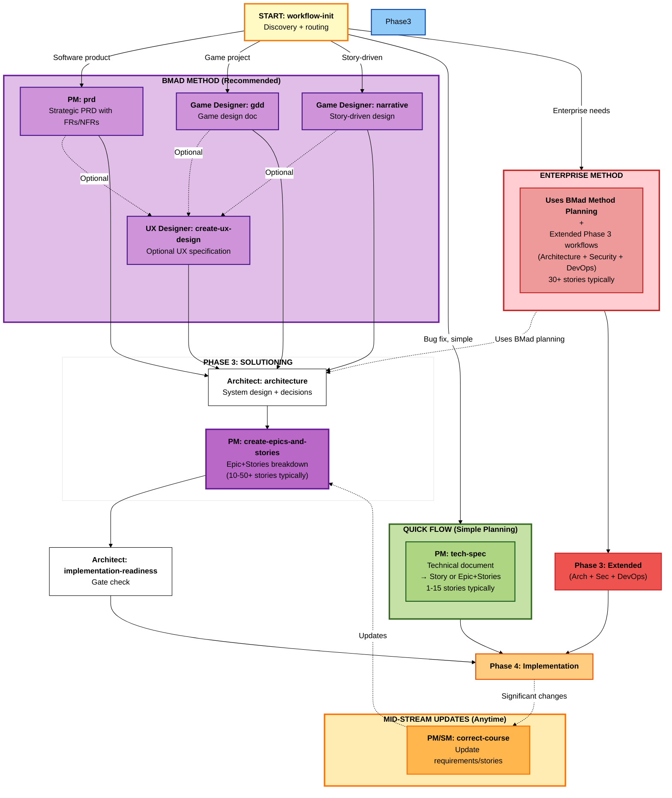

# BMM Planning Workflows (Phase 2)

**Reading Time:** ~10 minutes

## Overview

Phase 2 (Planning) workflows are **required** for all projects. They transform strategic vision into actionable requirements using a **scale-adaptive system** that automatically selects the right planning depth based on project complexity.

**Key principle:** One unified entry point (`workflow-init`) intelligently routes to the appropriate planning methodology - from quick tech-specs to comprehensive PRDs.

**When to use:** All projects require planning. The system adapts depth automatically based on complexity.

---

## Phase 2 Planning Workflow Map



---

## Quick Reference

| Workflow                     | Agent         | Track       | Purpose                                                   | Typical Stories |
| ---------------------------- | ------------- | ----------- | --------------------------------------------------------- | --------------- |
| **workflow-init**            | PM/Analyst    | All         | Entry point: discovery + routing                          | N/A             |
| **tech-spec**                | PM            | Quick Flow  | Technical document → Story or Epic+Stories                | 1-15            |
| **prd**                      | PM            | BMad Method | Strategic PRD with FRs/NFRs (no epic breakdown)           | 10-50+          |
| **brd-to-spec-ledger**      | Analyst       | BMad Method | Parse BRD/PRD into structured Spec Ledger (required)    | N/A             |
| **generate-spec-ledger-doc**| PM            | BMad Method | Generate Spec Ledger master document (optional)          | N/A             |
| **lint-spec-ledger**        | Analyst, PM, TEA | BMad Method | Validate Spec Ledger for orphan refs, duplicates, gaps (recommended) | N/A |
| **sync-ledger-to-bmad-artifacts** | PM      | BMad Method | Sync Spec Ledger into PRD/architecture (required)       | N/A             |
| **gdd**                      | Game Designer | BMad Method | Game Design Document with requirements                    | 10-50+          |
| **narrative**                | Game Designer | BMad Method | Story-driven game/experience design                       | 10-50+          |
| **create-ux-design**         | UX Designer   | BMad Method | Optional UX specification (after PRD)                     | N/A             |
| **propose-stories-from-ledger** | PM        | BMad Method | Generate story files from Spec Ledger (optional)         | N/A             |
| **create-epics-and-stories** | PM            | BMad Method | Break requirements into Epic+Stories (AFTER architecture) | N/A             |
| **correct-course**           | PM/SM         | All         | Mid-stream requirement changes                            | N/A             |

**Note:** Story counts are guidance. V6 improvement: Epic+Stories are created AFTER architecture for better quality.

---

## Scale-Adaptive Planning System

BMM uses three distinct planning tracks that adapt to project complexity:

### Track 1: Quick Flow

**Best For:** Bug fixes, simple features, clear scope, enhancements

**Planning:** Tech-spec only → Implementation

**Time:** Hours to 1 day

**Story Count:** Typically 1-15 (guidance)

**Documents:** tech-spec.md + story files

**Example:** "Fix authentication bug", "Add OAuth social login"

---

### Track 2: BMad Method (RECOMMENDED)

**Best For:** Products, platforms, complex features, multiple epics

**Planning:** PRD + Architecture → Implementation

**Time:** 1-3 days

**Story Count:** Typically 10-50+ (guidance)

**Documents:** PRD.md (FRs/NFRs) + architecture.md + epics.md + epic files

**Greenfield:** Product Brief (optional) → PRD (FRs/NFRs) → **BRD→Spec Ledger** → Generate Spec Ledger Doc (optional) → Sync Ledger to Artifacts → UX (optional) → Architecture → Propose Stories from Ledger (optional) → Epics+Stories → Implementation

**Brownfield:** document-project → PRD (FRs/NFRs) → **BRD→Spec Ledger** → Generate Spec Ledger Doc (optional) → Sync Ledger to Artifacts → Architecture (recommended) → Propose Stories from Ledger (optional) → Epics+Stories → Implementation

**Note:** Spec Ledger is the single source of truth for requirements and design. It solves context loss in large projects by maintaining structured data instead of giant text documents. PRD, architecture, and frontend specs reference ledger IDs and load only relevant slices.

**Example:** "Customer dashboard", "E-commerce platform", "Add search to existing app"

**Why Architecture for Brownfield?** Distills massive codebase context into focused solution design for your specific project.

---

### Track 3: Enterprise Method

**Best For:** Enterprise requirements, multi-tenant, compliance, security-sensitive

**Planning (Phase 2):** Uses BMad Method planning (PRD with FRs/NFRs)

**Solutioning (Phase 3):** Extended workflows (Architecture + Security + DevOps + SecOps as optional additions) → Epics+Stories

**Time:** 3-7 days total (1-3 days planning + 2-4 days extended solutioning)

**Story Count:** Typically 30+ (but defined by enterprise needs)

**Documents Phase 2:** PRD.md (FRs/NFRs)

**Documents Phase 3:** architecture.md + epics.md + epic files + security-architecture.md (optional) + devops-strategy.md (optional) + secops-strategy.md (optional)

**Example:** "Multi-tenant SaaS", "HIPAA-compliant portal", "Add SOC2 audit logging"

---

## How Track Selection Works

`workflow-init` guides you through educational choice:

1. **Description Analysis** - Analyzes project description for complexity
2. **Educational Presentation** - Shows all three tracks with trade-offs
3. **Recommendation** - Suggests track based on keywords and context
4. **User Choice** - You select the track that fits

The system guides but never forces. You can override recommendations.

---

## Workflow Descriptions

### workflow-init (Entry Point)

**Purpose:** Single unified entry point for all planning. Discovers project needs and intelligently routes to appropriate track.

**Agent:** PM (orchestrates others as needed)

**Always Use:** This is your planning starting point. Don't call prd/gdd/tech-spec directly unless skipping discovery.

**Process:**

1. Discovery (understand context, assess complexity, identify concerns)
2. Routing Decision (determine track, explain rationale, confirm)
3. Execute Target Workflow (invoke planning workflow, pass context)
4. Handoff (document decisions, recommend next phase)

---

### tech-spec (Quick Flow)

**Purpose:** Lightweight technical specification for simple changes (Quick Flow track). Produces technical document and story or epic+stories structure.

**Agent:** PM

**When to Use:**

- Bug fixes
- Single API endpoint additions
- Configuration changes
- Small UI component additions
- Isolated validation rules

**Key Outputs:**

- **tech-spec.md** - Technical document containing:
  - Problem statement and solution
  - Source tree changes
  - Implementation details
  - Testing strategy
  - Acceptance criteria
- **Story file(s)** - Single story OR epic+stories structure (1-15 stories typically)

**Skip To Phase:** 4 (Implementation) - no Phase 3 architecture needed

**Example:** "Fix null pointer when user has no profile image" → Single file change, null check, unit test, no DB migration.

---

### prd (Product Requirements Document)

**Purpose:** Strategic PRD with Functional Requirements (FRs) and Non-Functional Requirements (NFRs) for software products (BMad Method track).

**Agent:** PM (with Architect and Analyst support)

**When to Use:**

- Medium to large feature sets
- Multi-screen user experiences
- Complex business logic
- Multiple system integrations
- Phased delivery required

**Scale-Adaptive Structure:**

- **Light:** Focused FRs/NFRs, simplified analysis (10-15 pages)
- **Standard:** Comprehensive FRs/NFRs, thorough analysis (20-30 pages)
- **Comprehensive:** Extensive FRs/NFRs, multi-phase, stakeholder analysis (30-50+ pages)

**Key Outputs:**

- PRD.md (complete requirements with FRs and NFRs)

**Note:** V6 improvement - PRD focuses on WHAT to build (requirements). Epic+Stories are created AFTER architecture via `create-epics-and-stories` workflow for better quality.

**Integration:** Feeds into Spec Ledger pipeline, then Architecture (Phase 3)

**Example:** E-commerce checkout → PRD with 15 FRs (user account, cart management, payment flow) and 8 NFRs (performance, security, scalability).

---

### Spec Ledger Workflows (BMad Method & Enterprise Method)

**Purpose:** Spec Ledger is the **single source of truth** for requirements and design. It solves context loss in large projects by maintaining structured data (workbook-style sheets) instead of giant text documents. PRD, architecture, and frontend specs reference ledger IDs and load only relevant slices.

**Why Spec Ledger?**
- **Context Management:** Large PRDs/architectures don't need to live fully in model context
- **Traceability:** Full traceability from BRD → Requirements → Data/UI/API/States/ACs → User Stories
- **Iterative Refinement:** Q&A-driven workflows update only relevant rows without destroying confirmed fields
- **Single Source of Truth:** All requirements and design details in structured format

**Workflows:**

#### brd-to-spec-ledger

**Agent:** Analyst

**Purpose:** Parse BRD/PRD documents into structured Spec Ledger entries with traceability.

**Process:**
1. Segment BRD into analyzable chunks
2. Classify each segment (FR/NFR/UI/API/BR/Misc)
3. Extract actors, workflows, entities, states, ACs
4. Wire traceability (BRD segments → Requirements → Entities/Pages/APIs/ACs)
5. Generate BRD_Parse_Log with confidence scores and ambiguities
6. Ask targeted clarification questions for ambiguous segments

**Key Outputs:**
- `spec-ledger.json` - Structured ledger with all sheets (Requirements, Workflows, Entities, Fields, Pages, APIs, ACs, User_Stories, Traceability, etc.)
- `brd-parse-log.md` - Parse log with confidence scores and ambiguities

**When Ambiguous:** Workflow asks targeted questions, then updates only relevant ledger rows without wiping confirmed information.

---

#### generate-spec-ledger-doc

**Agent:** PM

**Purpose:** Generate comprehensive Spec Ledger master document from ledger sheets.

**Process:**
1. Load all ledger sheets
2. Generate sections: Requirements, Workflows, State Models, Data Model, UI Surfaces, API Surface, Events, Errors, KPIs, User Stories, Traceability Matrix, Coverage Summary
3. Load only relevant slices per section to stay within context

**Key Outputs:**
- `spec-ledger-master.md` - Complete master document (single source of truth)

**Note:** This document is a **view** of the ledger, not the ledger itself. The ledger JSON is the canonical store.

---

#### lint-spec-ledger

**Agent:** Analyst, PM, TEA

**Purpose:** Validate the Spec Ledger for quality issues before moving to Solutioning/Development.

**Process:**
1. Check for duplicate IDs across all sheets
2. Identify orphan references (actions not used, APIs without links, ACs without requirements/workflows)
3. Validate User Story references (requirements, APIs, entities, pages, ACs)
4. Check basic coverage (workflows with entities, pages, APIs, ACs)
5. Summarize BRD_Parse_Log status if present

**Key Outputs:**
- `spec-ledger-lint-report.md` - Report with errors (must fix) and warnings (nice to address)

**When to Use:** Recommended as a final check after Spec Ledger is populated and before moving fully into Solutioning/Development. It checks for orphan references, duplicate IDs, and basic coverage gaps.

---

#### sync-ledger-to-bmad-artifacts

**Agent:** PM

**Purpose:** Sync Spec Ledger content into PRD, architecture hints, frontend spec, and BMad story artifacts.

**Process:**
1. Update/augment PRD sections with precise requirements (add req_id references)
2. Suggest architecture hints (entities, state models, APIs, events, external systems)
3. Suggest/refine frontend spec (pages, page fields, actions, role mappings)
4. Ensure BMad Epics/Stories align with ledger Requirements & Workflows

**Key Principle:** Merge/augment using existing patterns - do NOT hard-overwrite PRD or architecture.

**Key Outputs:**
- Updated PRD.md with ledger references
- Architecture hints (or architecture-hints.md)
- Frontend spec (frontend-spec.md)
- Updated epic files with workflow_id references

---

#### propose-stories-from-ledger

**Agent:** PM

**Purpose:** Use User_Stories entries to generate or update BMad story files with full traceability.

**Process:**
1. Read User_Stories sheet
2. For each story with status = candidate or drafted:
   - Propose/update story file (story-*.md)
   - Include links to requirement_ids_ref, api_ids_ref, entities_ref, ac_ids_ref
   - Link to workflow_id, pages_ref, action_id
3. Group stories into epics by workflow/module
4. Update story status in ledger

**Key Outputs:**
- Story files (story-*.md) with full traceability
- Epic files grouped by workflow

**Integration:** Can be used before or after `create-epics-and-stories` workflow.

---

### gdd (Game Design Document)

**Purpose:** Complete game design document for game projects (BMad Method track).

**Agent:** Game Designer

**When to Use:**

- Designing any game (any genre)
- Need comprehensive design documentation
- Team needs shared vision
- Publisher/stakeholder communication

**BMM GDD vs Traditional:**

- Scale-adaptive detail (not waterfall)
- Agile epic structure
- Direct handoff to implementation
- Integrated with testing workflows

**Key Outputs:**

- GDD.md (complete game design)
- Epic breakdown (Core Loop, Content, Progression, Polish)

**Integration:** Feeds into Architecture (Phase 3)

**Example:** Roguelike card game → Core concept (Slay the Spire meets Hades), 3 characters, 120 cards, 50 enemies, Epic breakdown with 26 stories.

---

### narrative (Narrative Design)

**Purpose:** Story-driven design workflow for games/experiences where narrative is central (BMad Method track).

**Agent:** Game Designer (Narrative Designer persona) + Creative Problem Solver (CIS)

**When to Use:**

- Story is central to experience
- Branching narrative with player choices
- Character-driven games
- Visual novels, adventure games, RPGs

**Combine with GDD:**

1. Run `narrative` first (story structure)
2. Then run `gdd` (integrate story with gameplay)

**Key Outputs:**

- narrative-design.md (complete narrative spec)
- Story structure (acts, beats, branching)
- Characters (profiles, arcs, relationships)
- Dialogue system design
- Implementation guide

**Integration:** Combine with GDD, then feeds into Architecture (Phase 3)

**Example:** Choice-driven RPG → 3 acts, 12 chapters, 5 choice points, 3 endings, 60K words, 40 narrative scenes.

---

### ux (UX-First Design)

**Purpose:** UX specification for projects where user experience is the primary differentiator (BMad Method track).

**Agent:** UX Designer

**When to Use:**

- UX is primary competitive advantage
- Complex user workflows needing design thinking
- Innovative interaction patterns
- Design system creation
- Accessibility-critical experiences

**Collaborative Approach:**

1. Visual exploration (generate multiple options)
2. Informed decisions (evaluate with user needs)
3. Collaborative design (refine iteratively)
4. Living documentation (evolves with project)

**Key Outputs:**

- ux-spec.md (complete UX specification)
- User journeys
- Wireframes and mockups
- Interaction specifications
- Design system (components, patterns, tokens)
- Epic breakdown (UX stories)

**Integration:** Feeds PRD or updates epics, then Architecture (Phase 3)

**Example:** Dashboard redesign → Card-based layout with split-pane toggle, 5 card components, 12 color tokens, responsive grid, 3 epics (Layout, Visualization, Accessibility).

---

### create-epics-and-stories

**Purpose:** Break requirements into bite-sized stories organized in epics (BMad Method track).

**Agent:** PM

**When to Use:**

- **REQUIRED:** After Architecture workflow is complete (Phase 3)
- After PRD defines FRs/NFRs and Architecture defines HOW to build
- Optional: Can also run earlier (after PRD, after UX) for basic structure, then refined after Architecture

**Key Outputs:**

- epics.md (all epics with story breakdown)
- Epic files (epic-1-\*.md, etc.)

**V6 Improvement:** Epics+Stories are now created AFTER architecture for better quality:

- Architecture decisions inform story breakdown (tech choices affect implementation)
- Stories have full context (PRD + UX + Architecture)
- Better sequencing with technical dependencies considered

---

### correct-course

**Purpose:** Handle significant requirement changes during implementation (all tracks).

**Agent:** PM, Architect, or SM

**When to Use:**

- Priorities change mid-project
- New requirements emerge
- Scope adjustments needed
- Technical blockers require replanning

**Process:**

1. Analyze impact of change
2. Propose solutions (continue, pivot, pause)
3. Update affected documents (PRD, epics, stories)
4. Re-route for implementation

**Integration:** Updates planning artifacts, may trigger architecture review

---

## Decision Guide

### Which Planning Workflow?

**Use `workflow-init` (Recommended):** Let the system discover needs and route appropriately.

**Direct Selection (Advanced):**

- **Bug fix or single change** → `tech-spec` (Quick Flow)
- **Software product** → `prd` (BMad Method)
- **Game (gameplay-first)** → `gdd` (BMad Method)
- **Game (story-first)** → `narrative` + `gdd` (BMad Method)
- **UX innovation project** → `ux` + `prd` (BMad Method)
- **Enterprise with compliance** → Choose track in `workflow-init` → Enterprise Method

---

## Integration with Phase 3 (Solutioning)

Planning outputs feed into Solutioning:

| Planning Output     | Solutioning Input                    | Track Decision               |
| ------------------- | ------------------------------------ | ---------------------------- |
| tech-spec.md        | Skip Phase 3 → Phase 4 directly      | Quick Flow (no architecture) |
| PRD.md              | **architecture** (Level 3-4)         | BMad Method (recommended)    |
| GDD.md              | **architecture** (game tech)         | BMad Method (recommended)    |
| narrative-design.md | **architecture** (narrative systems) | BMad Method                  |
| ux-spec.md          | **architecture** (frontend design)   | BMad Method                  |
| Enterprise docs     | **architecture** + security/ops      | Enterprise Method (required) |

**Key Decision Points:**

- **Quick Flow:** Skip Phase 3 entirely → Phase 4 (Implementation)
- **BMad Method:** Optional Phase 3 (simple), Required Phase 3 (complex)
- **Enterprise:** Required Phase 3 (architecture + extended planning)

See: [workflows-solutioning.md](./workflows-solutioning.md)

---

## Best Practices

### 1. Always Start with workflow-init

Let the entry point guide you. It prevents over-planning simple features or under-planning complex initiatives.

### 2. Trust the Recommendation

If `workflow-init` suggests BMad Method, there's likely complexity you haven't considered. Review carefully before overriding.

### 3. Iterate on Requirements

Planning documents are living. Refine PRDs/GDDs as you learn during Solutioning and Implementation.

### 4. Involve Stakeholders Early

Review PRDs/GDDs with stakeholders before Solutioning. Catch misalignment early.

### 5. Focus on "What" Not "How"

Planning defines **what** to build and **why**. Leave **how** (technical design) to Phase 3 (Solutioning).

### 6. Document-Project First for Brownfield

Always run `document-project` before planning brownfield projects. AI agents need existing codebase context.

---

## Common Patterns

### Greenfield Software (BMad Method)

```
1. (Optional) Analysis: product-brief, research
2. workflow-init → routes to prd
3. PM: prd workflow
4. (Optional) UX Designer: ux workflow
5. PM: create-epics-and-stories (may be automatic)
6. → Phase 3: architecture
```

### Brownfield Software (BMad Method)

```
1. Technical Writer or Analyst: document-project
2. workflow-init → routes to prd
3. PM: prd workflow
4. PM: create-epics-and-stories
5. → Phase 3: architecture (recommended for focused solution design)
```

### Bug Fix (Quick Flow)

```
1. workflow-init → routes to tech-spec
2. Architect: tech-spec workflow
3. → Phase 4: Implementation (skip Phase 3)
```

### Game Project (BMad Method)

```
1. (Optional) Analysis: game-brief, research
2. workflow-init → routes to gdd
3. Game Designer: gdd workflow (or narrative + gdd if story-first)
4. Game Designer creates epic breakdown
5. → Phase 3: architecture (game systems)
```

### Enterprise Project (Enterprise Method)

```
1. (Recommended) Analysis: research (compliance, security)
2. workflow-init → routes to Enterprise Method
3. PM: prd workflow
4. (Optional) UX Designer: ux workflow
5. PM: create-epics-and-stories
6. → Phase 3: architecture + security + devops + test strategy
```

---

## Common Anti-Patterns

### ❌ Skipping Planning

"We'll just start coding and figure it out."
**Result:** Scope creep, rework, missed requirements

### ❌ Over-Planning Simple Changes

"Let me write a 20-page PRD for this button color change."
**Result:** Wasted time, analysis paralysis

### ❌ Planning Without Discovery

"I already know what I want, skip the questions."
**Result:** Solving wrong problem, missing opportunities

### ❌ Treating PRD as Immutable

"The PRD is locked, no changes allowed."
**Result:** Ignoring new information, rigid planning

### ✅ Correct Approach

- Use scale-adaptive planning (right depth for complexity)
- Involve stakeholders in review
- Iterate as you learn
- Keep planning docs living and updated
- Use `correct-course` for significant changes

---

## Related Documentation

- [Phase 1: Analysis Workflows](./workflows-analysis.md) - Optional discovery phase
- [Phase 3: Solutioning Workflows](./workflows-solutioning.md) - Next phase
- [Phase 4: Implementation Workflows](./workflows-implementation.md)
- [Scale Adaptive System](./scale-adaptive-system.md) - Understanding the three tracks
- [Quick Spec Flow](./quick-spec-flow.md) - Quick Flow track details
- [Agents Guide](./agents-guide.md) - Complete agent reference

---

## Troubleshooting

**Q: Which workflow should I run first?**
A: Run `workflow-init`. It analyzes your project and routes to the right planning workflow.

**Q: Do I always need a PRD?**
A: No. Simple changes use `tech-spec` (Quick Flow). Only BMad Method and Enterprise tracks create PRDs.

**Q: Can I skip Phase 3 (Solutioning)?**
A: Yes for Quick Flow. Optional for BMad Method (simple projects). Required for BMad Method (complex projects) and Enterprise.

**Q: How do I know which track to choose?**
A: Use `workflow-init` - it recommends based on your description. Story counts are guidance, not definitions.

**Q: What if requirements change mid-project?**
A: Run `correct-course` workflow. It analyzes impact and updates planning artifacts.

**Q: Do brownfield projects need architecture?**
A: Recommended! Architecture distills massive codebase into focused solution design for your specific project.

**Q: When do I run create-epics-and-stories?**
A: Usually automatic during PRD/GDD. Can also run standalone later to regenerate epics.

**Q: Should I use product-brief before PRD?**
A: Optional but recommended for greenfield. Helps strategic thinking. `workflow-init` offers it based on context.

---

_Phase 2 Planning - Scale-adaptive requirements for every project._
